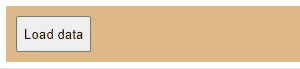

# wait-loading component

This is a spin-like component. You could use it to indicate that something is going on and the user should wait for it. It is a standard custom web component written in pure vanilla JS, so it could be used in any framework.

> With the package you will find a complete functional example (**example.html, example.css, example.js**)

## Usage:
Use it like any standard tag:
- In html: `<wait-loading></wait-loading>`
- In JS: `document.createElement("wait-loading")`

If you add `<wait-loading></wait-loading>` to the html document then you should control its `visibility` or its `display` properties to control when it is shown to or hidden from the user. The alternative usage is to create the element in JS and append it when and where you want. When you want to hide it just remove it from the document (see the example).

## Styling:
1. Define in an element's selector block one or more of the following custom properties:
   - `--dot-size`: dot is actually a `div` element. This property controls the dimensions of the dots. Default is `0.25em`.
   - `--dot-color`: dot is actually a `div` element. This property controls the color of the dots. Default is `#dc3545`.

2. Or you can reach all dots by:
   - `::part(dot)`: dot is actually a `div` element. So you can style it in the way you like.

> Note: you could create this component by calling its constructor: `new WaitLoading(period)`. As you see you could pass the parameter `period` which should be a number that indicates the period (complete cycle) of animation. This parameter indicates the period time in ms (milli-seconds). The default value is 900ms. 
> Note that to be able to create the component by calling its constructor `new WaitLoading(period)` you should have a modular JS and you should import the component's class `WaitLoading`.
